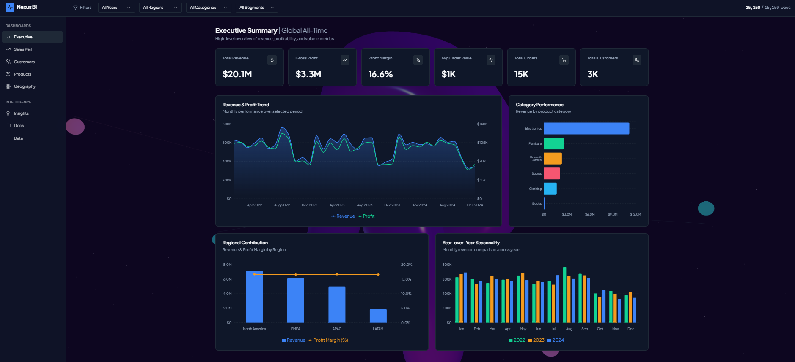

# Retail Sales & Customer Analytics Dashboard — Nexus BI

## Overview
Multi-page Power BI dashboard analyzing global retail sales, profitability, and customer behavior across regions and product categories, covering Apr 2022–Dec 2024.

## Business Problem
Retail leadership needs visibility into which regions, categories, and time periods drive revenue and profit, to guide inventory planning, regional strategy, and seasonal promotions.

## Data
Data from Kaggle

## Tools Used
Power BI, DAX, Power Query, SQL

## Key Insights
- Generated $20.1M in total revenue with a 16.6% profit margin across 15K orders and 3K customers, averaging $1K per order
- North America is the top-performing region by revenue, followed by EMEA, APAC, and LATAM, with profit margin holding steady around 15-16% across regions
- Electronics is the leading product category by revenue, well ahead of Furniture, Home & Garden, Sports, Clothing, and Books
- Year-over-year seasonality analysis shows consistent monthly revenue patterns across 2022, 2023, and 2024, useful for forecasting demand cycles

## Dashboard Preview

## Pages
- **Executive** — high-level KPIs and trends
- **Sales Performance** — detailed sales breakdown
- **Customers** — customer segmentation and behavior
- **Products** — category and product-level performance
- **Geography** — regional analysis
- **Insights** — key findings summary

## How to View
- Download the .pbix file and open in Power BI Desktop
